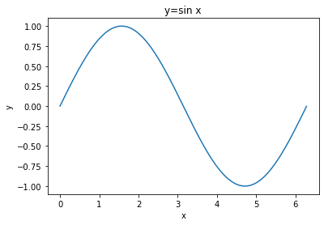
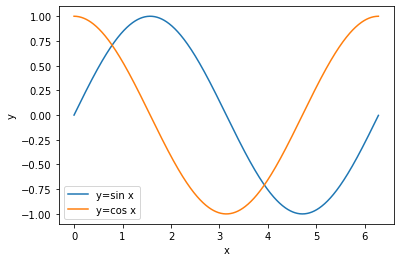
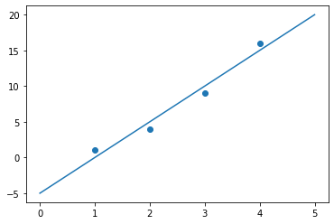
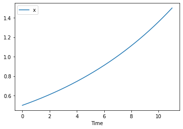
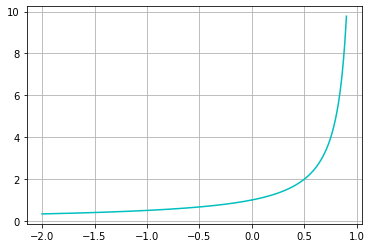
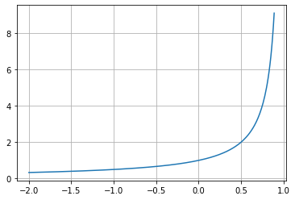
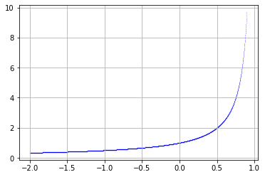
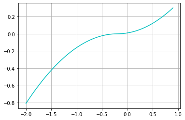

<script src="main.js"></script>
  <script type="text/javascript" id="MathJax-script" async
    src="https://cdn.jsdelivr.net/npm/mathjax@3/es5/tex-mml-chtml.js">
    </script>
  <script>
    MathJax = {
      loader: { load: ['[tex]/physics','[tex]/newcommand'] },
      tex: {
        inlineMath: [['$', '$'], ['\\(', '\\)']],
        packages: { '[+]': ['physics', 'newcommand'] },
      },
      chtml: {
        matchFontHeight: false
      }
    };
  </script>
  


# Python備忘録
これはPythonをしばらくいじらなくなって課題などでよく使う操作を忘れてしまった時のための備忘録である。

[ホームページに戻る](https://yumannimac.github.io/Homepage/)

##  $x-y$ 座標でのグラフ

###  一つのグラフ
簡単なグラフの書き方を最低限復習する。
下のグラフは`arrange`を用いて $y=\sin x$ のグラフを $x-y$ 平面に $\Delta x=0.01$ おきに $0$ から $2\pi$ までプロットしたものである。
`linspace`を用いる方法もある。


```python
import numpy as np
import matplotlib.pylab as plt

x = np.arange(0, 2*np.pi, 0.01)
plt.plot(x,np.sin(x))
plt.title('y=sin x') 
plt.xlabel('x') 
plt.ylabel('y')
plt.show()
```


    

    


`plt.show`でグラフを表示する。

### 複数のグラフ


```python
import numpy as np
import matplotlib.pylab as plt

x = np.arange(0, 2*np.pi, 0.01)
plt.plot(x, np.sin(x),label="y=sin x")
plt.plot(x, np.cos(x), label="y=cos x")

plt.title('')
plt.xlabel('x')
plt.ylabel('y')
plt.legend()
plt.show()

```


    

    


グラフが複数になるとどのグラフだか判別するための凡例が必要。`plt.legend`で凡例を表示できる。そのとき`plot`の中でラベリングすることを忘れずに。

## 回帰分析


```python
import numpy as np
from scipy import optimize
import matplotlib.pylab as plt
x = np.array([1, 2, 3, 4])
y = np.array([1, 4, 9, 16])


def f(x, a, b):
  return a*x+b


print("y=", optimize.curve_fit(f, x, y)[0][0], "x+",optimize.curve_fit(f, x, y)[0][1])
a, b = optimize.curve_fit(f, x, y)[0]
x0 = np.linspace(0, 5, 1001)
y0 = f(x0, a, b)
plt.scatter(x, y)
plt.plot(x0, y0)
plt.show()

```

    y= 5.000000000008725 x+ -5.000000000013091


    

    


ExcelではなくPythonで回帰分析をする状況で使うためのものである。ネットで調べてもコードは出てくるがそのほとんどがcsvファイル等アップロードするものであるから正直言って使いにくい。上に書いたコードは単体で完結する。

なお"optimize.curve_fit(f, x, y)[0]"はなんかよくわからないけど線形にフィッティングした時の(傾き, $y$ 切片)が入ったリストである。([1]とかにすると標準偏差が出てきた記憶がある）
```
def f(x, a, b):
    return a*(x)+b
```
の中身をたとえば $y=ax^2+b$ すなわち
`a*x**2+b`
とかにするとそのようにフィッティングされ、これまた(a,b)の値が出てくる。

なお
`plt.scatter(x, y)`
は
```
x = np.array([1, 2, 3, 4])
y = np.array([1, 4, 9, 16])
```
をそのままプロットしただけのものである。

## 微分方程式

### 一変数の場合
例えば関数 $x \left(t\right)$ の初期値問題

$$
x \left(0\right) =x_0=0.5,\frac{dx}{dt}=\frac{x}{10}
$$

の数値的な解は以下である。

なお解析的な解は

$$
x=\frac{1}{2}e^{\frac{t}{10}}
$$

である。


```python
import numpy as np
from scipy import integrate
import matplotlib.pyplot as plt


def f(x, t):
  return x/10


t = np.arange(0, 11, 0.01)
x0 = 0.5
result = integrate.odeint(f, x0, t)
plt.plot(t, result[:, 0], label='x')
plt.xlabel('Time')
plt.legend()
plt.show()

```


    

    


### 多変数の場合
ベクトル値関数 ${Y}\left(t\right)=\left(y_1,y_2\right)$ の初期値問題

$$
\frac{dy_1}{dt}=10-y_2, \frac{dy_2}{dt}=y_1,  \left(y_1 \left(0\right),y_2 \left(0\right) \right) =\left(1,1\right) 
$$

の数値的な解は以下。


```python
import numpy as np
from scipy import integrate
import matplotlib.pyplot as plt


def dfunc(Y, t):
  y1, y2 = Y
  return (10-y2, y1)


y1 = 1
y2 = 1
time = 10
Y0 = (y1, y2)
t = np.arange(0, time, 0.01)
result = integrate.odeint(dfunc, Y0, t)
plt.plot(t, result[:, 0], label='y1')
plt.plot(t, result[:, 1], label='y2')
plt.xlabel('Time')
plt.ylabel('y1,y2')
plt.legend()
plt.grid(True)
plt.show()

```


    

    


$3$ 変数以上の場合も同様。


一方上の方法だと負の方向に  $t$ が進むときに打てない。回避するには次のようにすれば良い。

下に書いたのは初期値問題

$$
\frac{dy}{dt}=y^{2}, y \left(0\right) =1
$$

を数値的に $t=-2$ から $t=0.9$ まで解いたものである。 $t=1$ で発散する。
ちなみに解析的な解は

$$
y=\left(1-t\right) ^{-1}=\frac{1}{1-t}
$$

である。


```python
import numpy as np
from scipy import integrate
import matplotlib.pyplot as plt


def f(t, y):
    return y**2
dt = 0.001
t0=0
y0=1
tne = -2
tpe = 0.9
#ここから計算
t_list = []
y_list = []
ipe = int(tpe/dt)
ine = int(-tne/dt)
t=t0
y=y0
for i in range(0, ipe):
  t += dt
  y += f(t, y)*dt
  t_list+=[t]
  y_list+=[y]
plt.plot(t_list, y_list,c="c",label="s1")#plt.plotはlistを目的語にとる、色はシアン("c")
t_list = []
y_list = []
t = t0
y = y0
for i in range(0, ine):
  t -= dt
  y -= f(t, y)*dt
  t_list += [t]
  y_list += [y]
plt.plot(t_list,y_list,c="c")
plt.grid(True)
plt.show()
#参考
x = np.arange(-2, 0.9, 0.01)
plt.plot(x,1/(1-x),label="s2")
plt.grid(True)
plt.show()


```


    

    


    

    


具体的には`integrate.obeint`を使わず代わりに繰り返しの命令`for`を用いた。またなめらかな曲線にするために`plt.scatter`（点をプロット）ではなく`plt.plot`（リストを目的語にとる、リスト中の値を直線で繋ぐ）を用いた。`plt.grid`を入れるとグリッド線が入る。あと`scatter`より`plot`の方が処理時間が圧倒的に短い。

ちなみに`plt.scatter`を入れると下のようになる。


```python
import numpy as np
from scipy import integrate
import matplotlib.pyplot as plt


def f(s, x):
    return x**2


dt = 0.001
t = 0
y = 1
tne = -2
tpe = 0.9
ipe = int(tpe/dt)
ine = int(-tne/dt)
for i in range(0, ipe):
  plt.scatter(t, y, s=10*dt, c="b")
  t = t+dt
  y += f(t, y)*dt
t = 0
y = 1
for i in range(0, ine):
  plt.scatter(t, y, s=10*dt, c="b")
  t = t-dt
  y = y-f(t, y)*dt
plt.grid(True)
plt.show()

```


    

    


次の微分方程式も解ける。


```python
import numpy as np
from scipy import integrate 
import matplotlib.pyplot as plt


def f(t, y):
    return abs(y)**0.5


dt = 0.001
t0 = 0
y0 = 0.01
tne = -2
tpe = 0.9
#ここから計算
t_list = []
y_list = []
ipe = int(tpe/dt)
ine = int(-tne/dt)
t = t0
y = y0
for i in range(0, ipe):
  t += dt
  y += f(t, y)*dt
  t_list += [t]
  y_list += [y]
plt.plot(t_list, y_list, c="c", label="s1")  # plt.plotはlistを目的語にとる、色はシアン("c")
t_list = []
y_list = []
t = t0
y = y0
for i in range(0, ine):
  t -= dt
  y -= f(t, y)*dt
  t_list += [t]
  y_list += [y]
plt.plot(t_list, y_list, c="c")
plt.grid(True)
plt.show()
#参考
x = np.arange(-2, 0.9, 0.01)
plt.plot(x, 1/(1-x), label="s2")
plt.grid(True)
plt.show()

```


    

    


    

    


## 条件付き関数の最大、最小問題

たとえば次のような問題を考える。

---------

$g\left(x,y,z\right)=x^2+y^2+z^2-1=0$ のもとで関数$ f\left(x,y,z\right)=x^2+y^2+z^2+4xy+4yz$ の極値を求めよ。

--- 

問題を解き切ることは不可能であるが最大値と最小値を求めることはpythonによってできる。


```python
from scipy.optimize import minimize

import numpy as np

# 目的関数


def func(x):
    return x[0] ** 2+x[1]**2+x[2]**2+4*x[0]*x[1]+4*x[1]*x[2]

# 制約条件式


def cons(x):
    return x[0] ** 2+x[1]**2+x[2]**2-1
cons = (
    {'type': 'eq', 'fun': cons},
)
x=[0.7,0.1,-0.7]

result = minimize(func, x0=x, constraints=cons, method="SLSQP")
print(result)
```

         fun: -1.8284271332952493
         jac: array([ 1.82841684, -2.58580284,  1.82841423])
     message: 'Optimization terminated successfully'
        nfev: 61
         nit: 14
        njev: 14
      status: 0
     success: True
           x: array([-0.50000087,  0.70710464, -0.50000217])


`x: array([-0.50000087,  0.70710464, -0.50000217])`が極値を与える $\left(x,y,z\right)$ の組、`fun: -1.8284271332952493`がその時の $f\left(x\right)$ の値を表す。

`minimize`関数は`scipy`ライブラリに含まれているもののなぜか`maximize`はないので最大値を求めたければ（仕方ないが）`func`の中身に`-`をつけて「最小値」を与える $\left(x,y,z\right)$ の組と最小値を計算するしかなさそう。極値に関しては手で計算して本当に極値になりそうか判断する基準にするくらいはできる。例えば下のコードでは $\left(x,y,z\right)$ の範囲を $\left(0.7 \pm 0.2,-0.5 \pm  0.2, 0.7 \pm 0.2	\right)$ にすることによって $\left(\dfrac{1}{\sqrt{2}},-\dfrac{1}{2},\dfrac{1}{\sqrt{2}}\right)$ が極値になるかを確かめている。


```python
from scipy.optimize import minimize

#import scipy
import numpy as np

# 目的関数


def func(x):
    return x[0] ** 2+x[1]**2+x[2]**2+4*x[0]*x[1]+4*x[1]*x[2]

# 制約条件式


def cons(x):
    return x[0] ** 2+x[1]**2+x[2]**2-1

# 範囲を確かめたい(x,y,z)の±0.2にして検算する,ineq は\geq0を表す
def p1(x):
	return (x[0]-0.5)+0.2


def p2(x):
	return -(x[0]-0.5)+0.2


def p3(x):
	return (x[1]+0.7)+0.2


def p4(x):
	return -(x[1]-0.7)+0.2


def p5(x):
	return (x[2]-0.5)+0.2


def p6(x):
	return -(x[2]-0.5)+0.2
cons = (
    {'type': 'eq', 'fun': cons},
    {'type': 'ineq', 'fun': p1},
   	{'type': 'ineq', 'fun': p2},
   	{'type': 'ineq', 'fun': p3},
   	{'type': 'ineq', 'fun': p4},
   	{'type': 'ineq', 'fun': p5},
   	{'type': 'ineq', 'fun': p6},
)
x=[0.55,-0.7,0.55]

result = minimize(func, x0=x, constraints=cons, method="SLSQP")
print(result)
```

         fun: -1.8284271368582918
         jac: array([-1.82844317,  2.58576292, -1.82844436])
     message: 'Optimization terminated successfully'
        nfev: 21
         nit: 5
        njev: 5
      status: 0
     success: True
           x: array([ 0.49999812, -0.70710986,  0.49999753])


ちなみに条件付き極値を求めるのに必要なラグランジュの未定乗数法の証明は[こちら](https://yumannimac.github.io/calculus/)に付した。

[ホームページに戻る](https://yumannimac.github.io/Homepage/)

<script src="https://blz-soft.github.io/md_style/release/v1.2/md_style.js" ></script>
